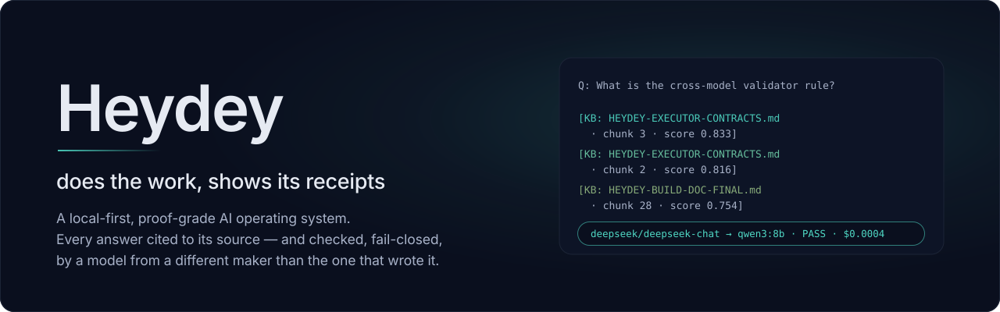
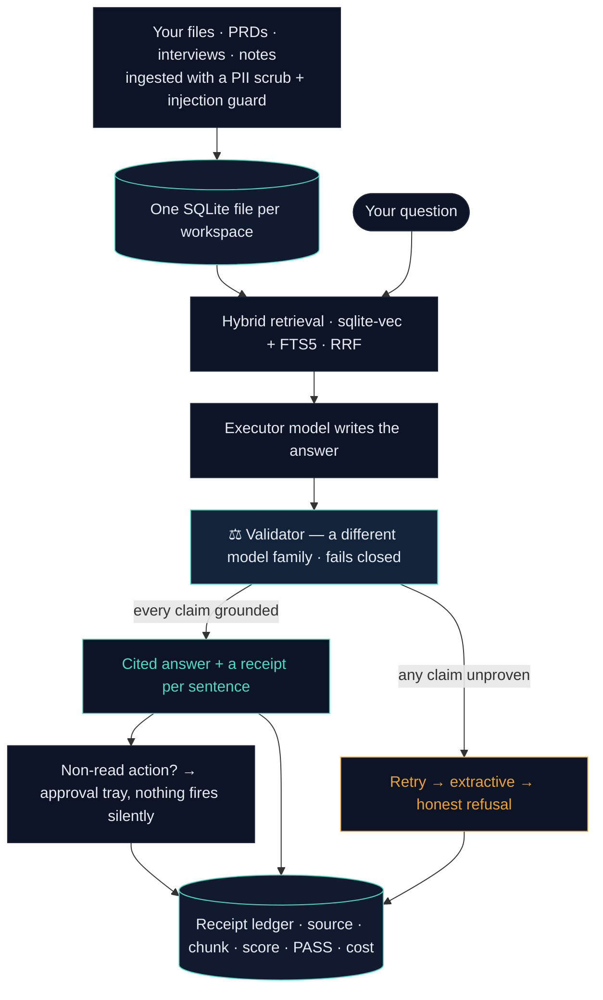

<p align="center">
  
</p>

<p align="center">
  <a href="https://github.com/apoorv427/heydey/actions/workflows/tests.yml"></a>
  
  
  
  
  <a href="LICENSE"></a>
</p>

*Your Mac, unchanged — with a brain underneath.*

> If this is useful to you, star it — the build ships in the open, gates and all.

Heydey answers questions and takes actions from your own files, and attaches a
machine-readable **receipt** to everything it does — the source document, the exact
chunk, the retrieval score, the cost, and a **fail-closed check by a model from a
different family than the one that wrote the answer**. If it can't ground a claim to a
source, it stays silent instead of guessing.

The GUI made your *files* legible. Heydey makes your *judgment* legible — the evidence
and verification state behind every AI action, which is normally invisible.

## Why it's different

- **Cross-model validation, enforced in code.** The model that writes an answer is never
  the model that checks it. The `executor_family ≠ validator_family` rule is enforced at
  config-write time — it can't be misconfigured — and the validator **fails closed** on
  anything it can't parse.
- **Local-first by construction.** One SQLite file per workspace (structural isolation, not
  a `WHERE workspace_id` filter). A `local-only` profile runs the entire pipeline offline at
  **$0** via Ollama — regulated data never has to leave the machine.
- **Receipts on every answer and action** — `source · chunk · score · validator pass/fail ·
  model · cost` — written to a ledger, not promised in a prompt.
- **Wrapper-free.** The agent runtime, retrieval engine, validator gate, supervisor,
  artifact engine, and MCP host are all hand-built. No langchain / langgraph / crewai /
  autogen; no Docker / Redis / Postgres / hosted vector DB — the ban is enforced by a CI grep.

## The receipt, in 30 seconds

Ask it about its own docs — this is real output, unedited (paths trimmed):

```text
Q: What is the cross-model validator rule in Heydey?

[Doc: HEYDEY-EXECUTOR-CONTRACTS | Section: A. The cross-model validator gate]
"…the validator (a model of a **different family** than the executor) is asked:
 does this sentence's assertion follow from the supplied chunks? …
 the router refuses same-family at config-write."

[KB: HEYDEY-EXECUTOR-CONTRACTS.md · chunk 3 · score 0.833]
[KB: HEYDEY-EXECUTOR-CONTRACTS.md · chunk 2 · score 0.816]
[KB: HEYDEY-BUILD-DOC-FINAL.md    · chunk 28 · score 0.754]

badge: deepseek/deepseek-chat → qwen3:8b · PASS   ·   $0.0004 · 0 ungrounded
```

Ask it something the corpus can't support, and it answers
**"The records don't cover this yet."** — the refusal *is* the feature.

## How an answer is earned

Every path below is code in this repo, not a diagram of intent — the fail-closed
branch on the right is why the refusal above happens.



A **local-only** profile runs that entire loop on your machine at **$0** — no bytes leave,
and the egress switch is enforced in code, not in a setting you have to trust.

## What you can do with it

**The hero flow — run your product org's memory (an AI Product Manager's setup):**

1. Point `~/.heydey/corpus.json` at your PRDs, user-interview transcripts, and
   competitor notes, then `python -m heydey.ops_ingest --workspace pm`.
2. Ask: *"what did users say about onboarding friction in the last ten interviews?"*
   You get either a **cited answer** — every sentence carrying a receipt
   (source · chunk · score · a different-family model's PASS · cost) with a
   breadcrumb that opens the exact source — or **silence**. Never a confident,
   synthesized-but-wrong summary of your users. That failure mode is the one
   this system exists to kill.
3. Run the 5-question Foundry onboarding and it stands up a small agent fleet
   from validated specs (competitor-watch · user-voice · roadmap-risk); the
   Morning Brief surfaces overnight deltas with citations, and any produced
   artifact (a PRD section draft) arrives as a **prepared action** — receipt
   attached, approval required, nothing fired silently.

**Real-world pattern:** an independent partner longevity-medicine firm runs a
sibling build — an AI OS we built on the same foundation as Heydey — daily: their
clinical team, no engineer, operating it for patient-journey content, research
syntheses, and digital assets from their own knowledge base. (Unpaid pilot;
sibling build — not Heydey's receipts engine. Converting them onto Heydey proper
is the first design-partner milestone.)

**The same shape works for any founder or small team** *(all illustrative)*:
- **Solo lawyer** — "which of these 40 contracts has an auto-renewal clause?" cited to the page, or silence.
- **Independent consultant** — 18 months of call notes → a cited case-study draft.
- **Academic** — silence instead of a hallucinated citation.
- **Small creative agency** — a 3-agent fleet from one 5-question interview.
- **D2C founder** — the Morning Brief cites the overnight order anomaly.
- **Compliance analyst** — the exact clause across hundreds of circulars, or nothing.

## Status

Feature-complete through the **S7** build slice (S0 → S7). Every slice ships against a
falsifiable gate — a command, a test, or a stopwatch — not a claim.

| Proof | State |
|---|---|
| Test suite | **278 / 278 passing** |
| Gate runners (retrieval · validator · isolation · auth · secrets · egress · connectors · foundry) | **11 / 11 green** |
| Retrieval gate (S2) | two documented hard-query failures now return the correct chunk **top-3** with a working breadcrumb |
| Cross-model validator (S3) | adversarial 50-prompt eval re-run 2026-07-27: **0 ungrounded · 0 fabrications** (every answer cleared the deterministic verbatim audit); a cross-family judge (deepseek) is the default second layer when determinism can't decide |
| Action-risk taxonomy (W2) | every tool + prepared action carries a tier (**read / write_local / exec / external**); anything non-read requires an approved tray row; the tier lands on the receipt row |
| OAuth connector plumbing (W2) | PKCE consent → token exchange → refresh in the OS Keychain (RFC-7636 vector-tested, mocked endpoints); Google Workspace read-only manifest; **live leg activates with real client credentials** |
| Per-workspace corpus blocks (W3) | a client workspace ingests **only its own block** — proven end-to-end: two workspaces, two db files, disjoint corpora |
| Secrets in tree or git history | **0** |
| Banned dependencies | **0** (CI-enforced) |

## What's built vs. what's next

**Built:** hybrid retrieval (sqlite-vec + FTS5, RRF) with per-chunk citations · cross-model
validator gate · receipt + cost ledger · read-only activity graph · episodic session recall ·
a hand-built MCP host · a Foundry that stands up a tailored agent fleet from a validated spec ·
a DPDP-style local-only egress switch · a Next.js instrument UI (Ask · Today · Library · Graph ·
Models · Agents · Connectors) where every surface ships four states (loaded / empty / error /
ingesting).

**Just landed:** **`heydey init`** — folders → workspace → ingest → retrieval gate → **TTFR
printed** (measured on a fresh environment: **2.9 minutes** to a cited, gate-checked answer) ·
the eval judge now defaults to a **third model family** (deepseek), with a loud warning on any
same-family fallback · the **4-tier action-risk taxonomy** and **OAuth + PKCE plumbing** for the
first real connector (Google Workspace, read-only — goes live when the OAuth client credentials
do) · **per-workspace corpus blocks** for multi-client installs · the **AI-PM playbook** behind
the hero flow above — doc-driven Morning-Brief section, the three-agent fleet, and the
PRD-section prepared action (verbatim quotes only, `write_local`, receipt attached).

**Next:** real OAuth connectors going live (the three shipped connectors are synthetic
**demo** MCP servers that exercise the security pipeline; the OAuth plumbing is built and
credential-gated) · a *strict* profile hardened by independent per-claim retrieval — the
[validator-independence experiment](docs/B7-VALIDATOR-INDEPENDENCE-2026-07-27.md) measured
the shared-input blind spot at ≈4.7% of claims, with the independent pass never rescuing a
failure (0 the other way).

## Quickstart

See **[INSTALL.md](INSTALL.md)** — honestly, **~15–20 minutes**: 3 prerequisites
(Python 3.12 · Node · [Ollama](https://ollama.com)) + 8 steps, including two multi-GB
local-model pulls. Founder-measured on a clean environment: **≈10 minutes to the first
cited, gate-checked answer** — fresh venv → ingest → the default retrieval gate GREEN,
zero source edits (the local-LLM pulls for the synthesis lane account for the rest). **No cloud account, no Docker, and no API key are
required for the $0 local-only mode**, which makes zero network calls. If it
worked for you, say so in the ["it worked" thread](../../issues) — with a
zero-telemetry product, that's the only way we ever know.

## Architecture

```
Next.js UI  ──HTTP+MCP──▶  supervisor (single job owner, 127.0.0.1, bearer-auth)
                               │
        agent runtime · retrieval · ingest guard (PII + injection) · MCP host ·
        model router · telemetry  ──▶  VALIDATOR GATE (cross-model, fail-closed)
                               │
                     heydey.db  (one SQLite file per workspace:
                     vectors · FTS · docs · receipts · costs · approvals ·
                     entities/relationships/activity_edges · sessions · connectors)
```

Allowed rails: Python 3.12, SQLite (+ sqlite-vec / FTS5), Ollama / MLX, thin raw-model API
clients, Next.js / React, D3.js (UI only), and the MCP protocol.

## License

[MIT](LICENSE).
